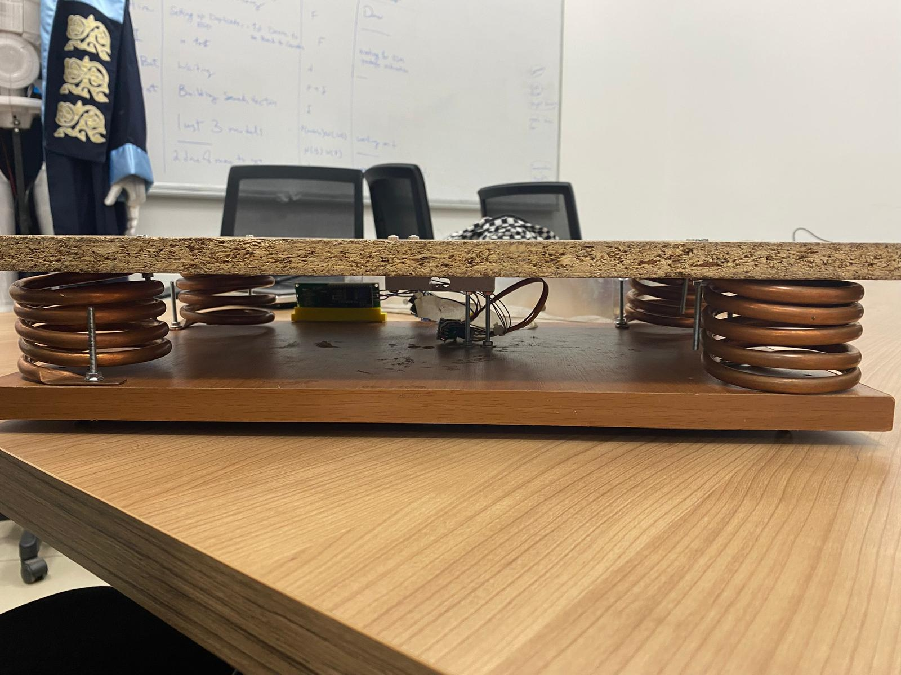
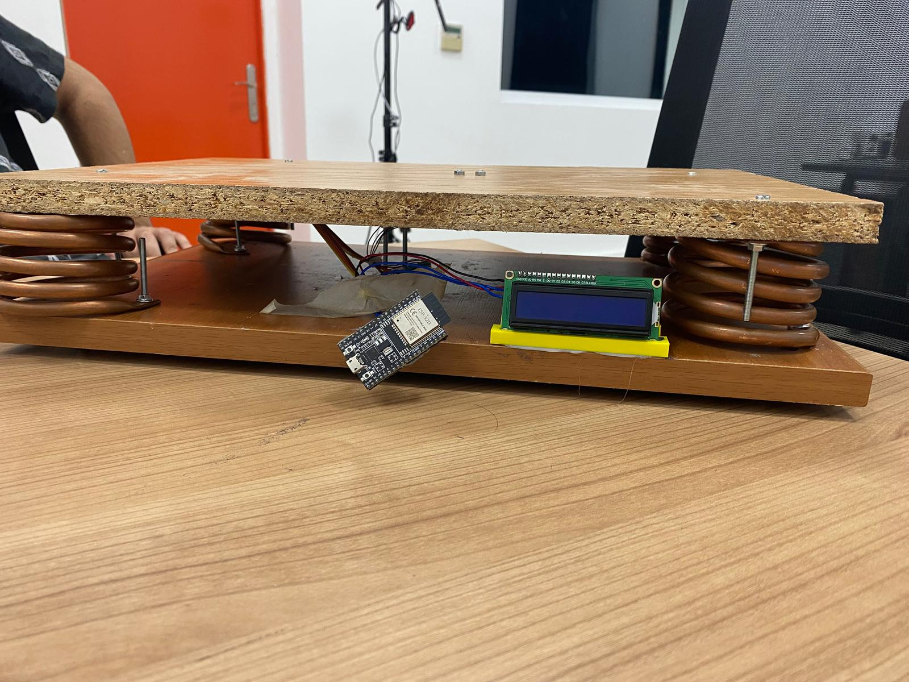

# 🍯 Smart Honey Box Scale — IoT Beehive Weight Monitor

> A fully hand-built IoT scale for beekeepers — track honey production remotely without disturbing the hive.  
> Built with ESP32 · HX711 · C++ · Supabase

**My role on this project:** Full mechanical build from raw materials + complete C++ embedded firmware. The mobile app was a separate component handled independently.

---

## 📸 Demo

### Side View — Spring Suspension System

*Two wooden platforms separated by 4 coil springs at the corners. The honey box sits on the top platform. Its weight compresses the springs; the load cell at center measures deflection.*

### Electronics — ESP32 + LCD

*ESP32 and I2C LCD mounted between the platforms. The LCD shows live weight. The ESP32 sends data to Supabase via WiFi.*

---

## The Problem

Beekeepers need to monitor honey production without opening the hive — every disturbance stresses the colony. Checking manually requires physical presence. **Weight is the most reliable production indicator:** a healthy colony gaining honey gains weight steadily.

## The Solution

A custom IoT scale the honey box sits on. Weighs continuously, sends data wirelessly — no hive opening, no physical presence needed.

---

## Mechanical Structure — Built From Scratch

```
┌──────────────────────────────────┐  ← Top platform (chipboard — honey box sits here)
│                                  │
│  [Spring]  [Load Cell]  [Spring] │  ← 4 coil springs + HX711 load cell at center
│                                  │
└──────────────────────────────────┘  ← Base platform (wood — ESP32 + LCD mounted here)
```

**No commercial scale frame used.** Every structural component was sourced and assembled by hand:
- Top platform: chipboard panel
- Base: wooden board
- Suspension: 4 coil springs, one at each corner
- Measurement: single-point load cell (20kg capacity) at geometric center
- Electronics mount: ESP32 DevKit + I2C LCD fixed to the base between the springs

**Key mechanical challenge:** Early versions tilted under uneven load, causing inconsistent readings. Fixed by repositioning the load cell to the exact geometric center and adding leveling bolts at each spring to keep the top platform horizontal.

---

## C++ Firmware (my primary contribution)

The firmware is the core of this project. It handles everything from raw sensor reading to cloud transmission.

### What the firmware does

1. **Reads the HX711** raw ADC value (24-bit resolution) every 500ms
2. **Applies calibration factor** to convert raw value → kg
3. **Noise filtering** — moving average over 5 readings to smooth vibration
4. **LCD output** — displays current weight live on the I2C screen
5. **WiFi transmission** — posts weight data to Supabase REST API every 60 seconds
6. **JSON payload** — structured data using ArduinoJson for clean database insertion

### Libraries used

```cpp
#include <HX711.h>              // Load cell amplifier driver
#include <LiquidCrystal_I2C.h> // I2C LCD control
#include <WiFi.h>               // ESP32 WiFi
#include <HTTPClient.h>         // HTTP POST to Supabase REST API
#include <ArduinoJson.h>        // JSON payload building
```

### Calibration process

The HX711 requires a one-time calibration with a known weight:

```cpp
// Step 1 — tare (zero the scale with empty platform)
scale.tare();

// Step 2 — place known weight, read raw value
long raw = scale.get_units(10); // average of 10 readings

// Step 3 — calculate calibration factor
float calibration_factor = raw / known_weight_kg;

// Step 4 — apply to all future readings
scale.set_scale(calibration_factor);
```

### Noise filtering (moving average)

```cpp
float readings[5];
int readIndex = 0;
float total = 0;

float getFilteredWeight() {
  total -= readings[readIndex];
  readings[readIndex] = scale.get_units();
  total += readings[readIndex];
  readIndex = (readIndex + 1) % 5;
  return total / 5;
}
```

### Supabase data transmission

```cpp
void sendToSupabase(float weight) {
  HTTPClient http;
  http.begin(supabaseUrl + "/rest/v1/hive_weights");
  http.addHeader("Content-Type", "application/json");
  http.addHeader("apikey", supabaseKey);
  http.addHeader("Authorization", "Bearer " + supabaseKey);

  StaticJsonDocument<128> doc;
  doc["weight_kg"] = weight;
  String payload;
  serializeJson(doc, payload);

  int responseCode = http.POST(payload);
  http.end();
}
```

---

## Hardware Wiring

```
HX711 DOUT ──── ESP32 GPIO16
HX711 SCK  ──── ESP32 GPIO4
HX711 VCC  ──── ESP32 3.3V
HX711 GND  ──── ESP32 GND

Load Cell (4-wire):
  Red   ──── HX711 E+  (excitation positive)
  Black ──── HX711 E-  (excitation negative)
  White ──── HX711 A-  (signal negative)
  Green ──── HX711 A+  (signal positive)

I2C LCD:
  SDA ──── ESP32 GPIO21
  SCL ──── ESP32 GPIO22
  VCC ──── ESP32 5V
  GND ──── ESP32 GND
```

---

## Getting Started

**Prerequisites**
- Arduino IDE with ESP32 board support installed
- Libraries: HX711, LiquidCrystal_I2C, ArduinoJson (install via Library Manager)

**1. Clone the repo**
```bash
git clone https://github.com/Benjaminkazam/Weight-scale.git
```

**2. Open firmware**
Open `firmware/scale.ino` in Arduino IDE

**3. Configure WiFi and Supabase**
```cpp
const char* ssid = "YOUR_WIFI_SSID";
const char* password = "YOUR_WIFI_PASSWORD";
const String supabaseUrl = "YOUR_SUPABASE_URL";
const String supabaseKey = "YOUR_SUPABASE_ANON_KEY";
```

**4. Run calibration once**
Upload with a known weight on the scale, read the serial monitor output, set your `calibration_factor`

**5. Deploy**
Upload final firmware — the scale is operational

---

## Test Results

| Test | Result |
|---|---|
| Max load tested | 20kg |
| Reading update rate | Every 500ms on LCD |
| Cloud sync interval | Every 60 seconds |
| Noise without filter | ±200g variation |
| Noise with moving average | ±20g variation |

---

## Future Improvements

- [ ] Solar panel + LiPo battery for fully off-grid operation
- [ ] Weatherproof enclosure for outdoor deployment
- [ ] DHT22 temperature + humidity sensor for environmental context
- [ ] Automated alert when weight drops >500g in 24h (swarm detection)

---

## Author

**Benjamin Kazamwali** — Computer Engineer  
benjaminkazas@gmail.com  
🔗 [Portfolio](https://benjaminkazam.web.app) · [GitHub](https://github.com/Benjaminkazam)

---

## License

MIT — free to use and adapt for agricultural or IoT applications.
